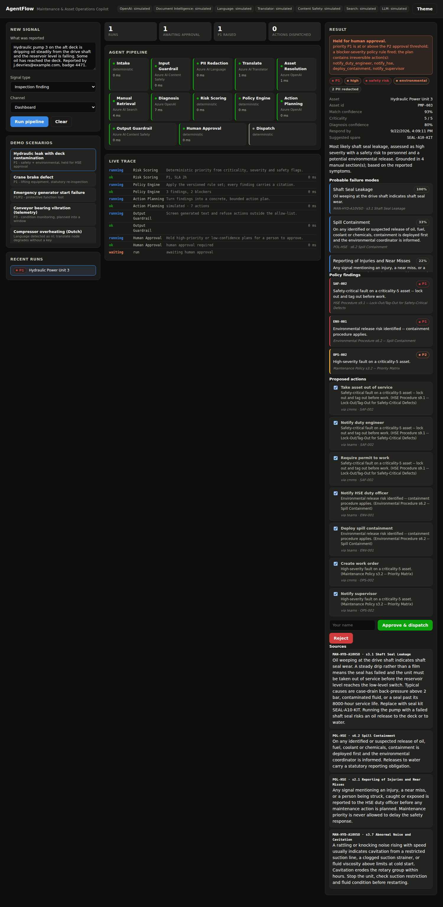

# AgentFlow

**An AI maintenance and asset operations copilot, with the agent pipeline you can actually watch run.**

Someone reports a fault in plain language — by email, in Teams, through a
Copilot Studio agent, or as a sensor alert. AgentFlow works out which piece of
equipment they mean, diagnoses the probable failure **against the equipment
manuals**, scores the risk, applies your written maintenance policy, and
proposes a bounded set of actions — a work order, a spare part, a duty-engineer
callout — with a human approval gate on anything that matters.

Every verdict carries a citation. Nothing gets dispatched that a rule cannot
justify.



## Run it

No cloud account, no API keys, no build step:

```bash
make install
make demo
```

Open <http://localhost:8000>, click a demo scenario, and watch the pipeline
execute node by node. Or:

```bash
docker compose up --build
```

With no credentials configured every Azure service falls back to a
deterministic local implementation, and the dashboard labels each one
`simulated` so a demo can never be mistaken for a live run. Add keys to `.env`
and the same code paths go to Azure.

## What actually happens

| # | Node | What it does | Service |
|---|------|--------------|---------|
| 1 | Intake | Normalise any channel into one canonical signal | — |
| 2 | Input guardrail | Screen for abuse and prompt injection **before a model sees it** | Azure AI Content Safety |
| 3 | PII redaction | Strip personal data before it leaves the trust boundary | Azure AI Language |
| 4 | Translate | Detect and normalise the reporting language | Azure AI Translator |
| 5 | Asset resolution | Match "the aft deck pump" to `PMP-003` | Registry + Azure OpenAI |
| 6 | Manual retrieval | Pull the manual sections that ground the diagnosis | Azure AI Search |
| 7 | Diagnosis | Failure modes, severity, safety risk — each cited | Azure OpenAI |
| 8 | Risk scoring | Priority from severity × criticality, deterministic | — |
| 9 | Policy engine | Versioned rules; every finding cites a policy clause | — |
| 10 | Action planning | Findings → a concrete plan, allow-list constrained | Azure OpenAI |
| 11 | Output guardrail | Screen generated text; reject any action off the list | Azure AI Content Safety |
| 12 | Human approval | Hold anything high-priority, low-confidence or irreversible | — |
| 13 | Dispatch | Execute through the connectors | Teams / Power Automate / CMMS |

The pipeline is `config/pipeline.yaml`. The dashboard renders that file, so the
picture on screen can never drift from what ran.

## Six design decisions worth defending

**1. The model diagnoses; rules decide.** The LLM proposes failure modes and
writes the explanation. Whether something is a P1, whether a human must sign
it off, and what actions are permitted are all decided by
[`config/rules.yaml`](config/rules.yaml) — deterministic, versioned,
unit-tested, and readable by the maintenance supervisor who owns the policy.
You cannot unit-test a prompt's judgement. You can unit-test this.

**2. Every finding carries a citation.** Not "the pump seal has probably
failed" but that, plus `MAN-HYD-A10VSO s3.1 Shaft Seal Leakage`, plus the
policy clause that made it a P1. A maintenance decision nobody can audit is a
maintenance decision nobody will trust twice.

**3. Fail closed, everywhere.** Guardrail unreachable → stop. Rule won't
evaluate → stop. Asset unidentified → a human looks at it, no work order gets
raised against `UNKNOWN`. The `dispatch` node is unreachable while a run is
`awaiting_approval`. The failure mode of an automation that takes real actions
on real equipment must be *doing nothing*, loudly.

**4. The action allow-list is a ceiling, not a suggestion.** The planner can
only emit ids from `allowed_actions`; anything else is dropped and recorded.
There is a test that feeds the planner a hostile action and asserts it never
reaches a connector.

**5. Retrieval is chunked by manual section, not token window.** `s4.2 Hoist
Brake Performance` *is* the citation an engineer needs. Chunk boundaries should
match the unit of reference.

**6. The agent logic is not in the low-code tool.** See below.

## Copilot Studio, Power Automate, n8n

The reasoning lives behind a REST API, and the orchestrators sit on top:

- **[`integrations/power-platform/`](integrations/power-platform/)** — a
  Swagger 2.0 custom connector, a Power Automate flow with an Approvals branch,
  and the Copilot Studio agent setup including the topic instructions.
- **[`integrations/n8n/`](integrations/n8n/)** — two importable workflows: a
  thin one that lets n8n drive this service, and a
  **[standalone](integrations/n8n/standalone/)** one that runs the entire
  pipeline inside n8n with no backend at all. Both run visually today with no
  licence.

Why not build it *inside* Copilot Studio? Because those tools are excellent at
triggers, Microsoft 365 connectors, approvals, identity and DLP — and poor at
version-controlled multi-step reasoning. You cannot diff a topic, unit-test a
branch, or roll back a prompt on its own. So Power Platform owns the edges and
this service owns the judgement. Swapping n8n for Power Automate changes no
logic at all, which is the proof the split is in the right place.

The long version, with the deployment steps, is in
[`integrations/power-platform/README.md`](integrations/power-platform/README.md).

## Making it yours

Nothing here is specific to one industry — the same pipeline runs for a
shipyard, a plant, a wind farm or a building portfolio. Three files:

| File | What it controls |
|---|---|
| [`config/assets.yaml`](config/assets.yaml) | Your equipment and spares (in production, a view over SAP PM / Maximo / Ultimo) |
| [`config/rules.yaml`](config/rules.yaml) | Your maintenance policy, with citations |
| [`knowledge/*.md`](knowledge/) | Your manuals, chunked by section |

Prompts live in [`config/prompts.yaml`](config/prompts.yaml), so tuning
behaviour is a reviewable diff rather than a code release.

## API

| Endpoint | |
|---|---|
| `POST /api/signals` | Submit a signal, get a run id, stream the trace |
| `POST /api/signals/sync` | Submit and wait for the finished result |
| `POST /api/runs/{id}/approve` | Apply a human decision |
| `POST /api/documents` | Upload a scanned report (Document Intelligence) |
| `GET /api/stream` | Server-sent events: the live trace |
| `GET /api/config` | The pipeline graph, service modes, rules, assets |
| `GET /docs` | Interactive API docs |

```bash
curl -X POST localhost:8000/api/signals/sync -H 'Content-Type: application/json' \
  -d '{"text":"Crane 2 is grinding when it brakes and the load drifts down after it stops."}'
```

```
priority   P1
asset      CRN-002 Gantry Crane 2
severity   critical   safety_risk: true
findings   SAF-002  Safety-critical fault on a criticality-5 asset
                    → HSE Procedure s9.1 Lock-Out/Tag-Out
           SAF-003  Defect on lifting equipment: statutory re-examination
                    → Lifting Equipment Standard s4.4
           OPS-001  Critical fault on a production-stopping asset
                    → Maintenance Policy s3.2 Priority Matrix
actions    freeze_asset · notify_duty_engineer · require_permit_to_work
           schedule_statutory_inspection · create_work_order
status     awaiting_approval — P1, blocker rule, irreversible actions
```

## Tests

```bash
make test    # 41 tests, no network, no keys
make lint

cd integrations/n8n/standalone && node test.mjs    # 11 more, for the n8n build
```

The n8n suite runs the exact `jsCode` strings that ship inside
`workflow.json`, so the low-code half of the repo is tested too.

The suites cover the parts that fail silently rather than loudly: that
prompt injection never reaches a model, that a rejected action never reaches a
connector, that an unidentified asset never gets a work order, that the planner
cannot invent an action, and that telemetry values cannot corrupt asset
matching.

## Security

- No secrets in the repo. `.env` is gitignored; use Key Vault and managed
  identity in Azure.
- Rule expressions are parsed with `ast` against a node allow-list — no calls,
  no attribute access, no imports. Tested against the usual `eval` escapes.
- Write endpoints take `X-API-Key` when `AGENTFLOW_API_KEY` is set. Put API
  Management or Entra ID in front of it for anything real.
- PII is redacted before the text reaches any model.
- Runs are appended to a JSONL audit trail with the full decision and its
  justification.

## Licence

MIT.
